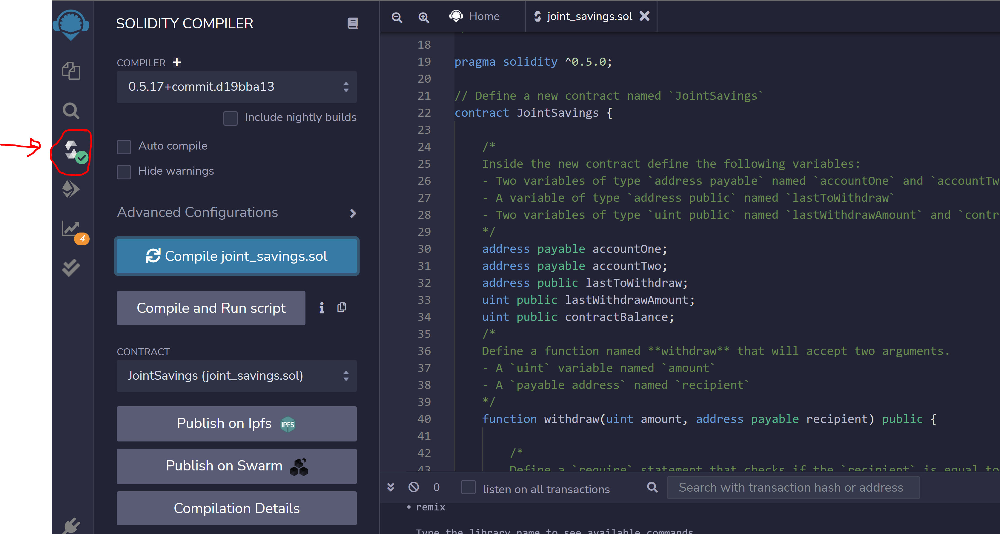
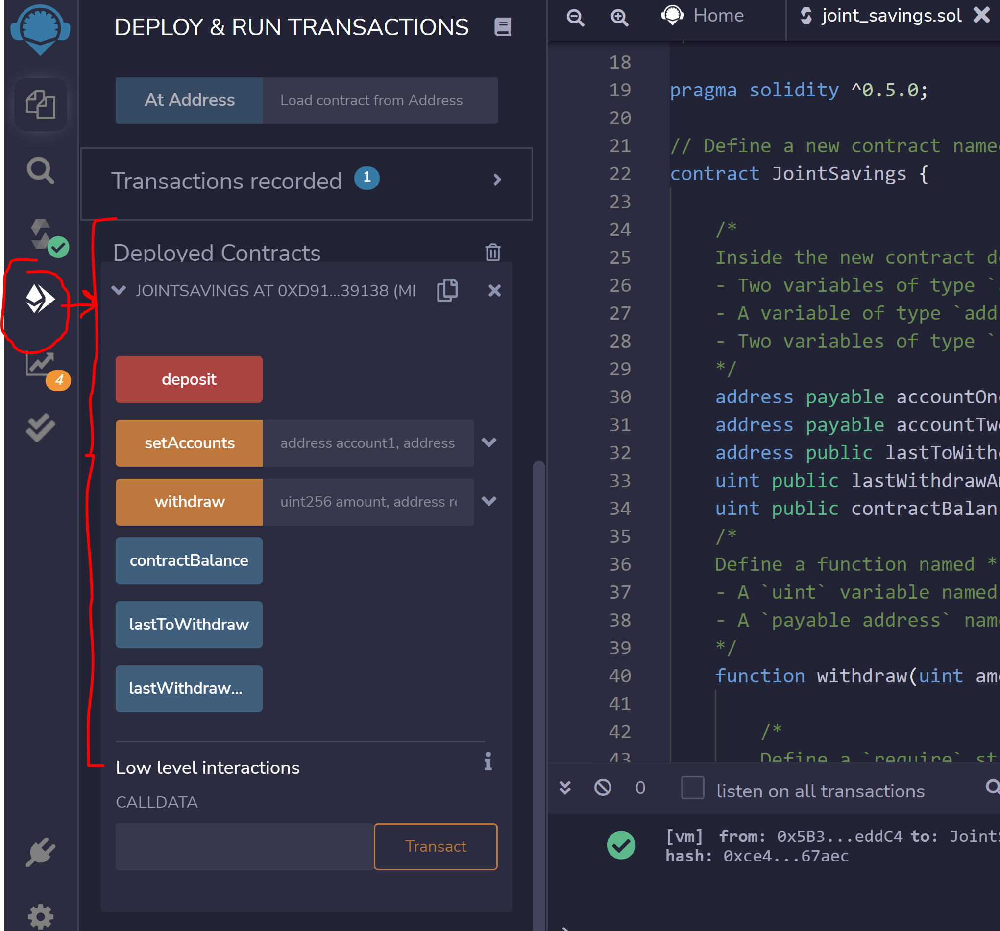
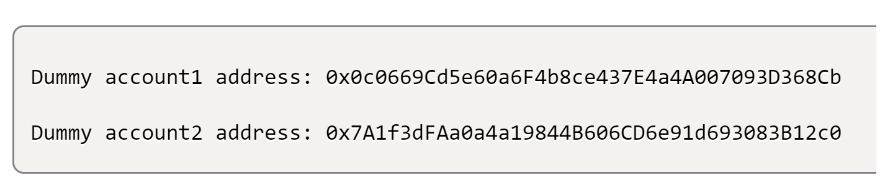
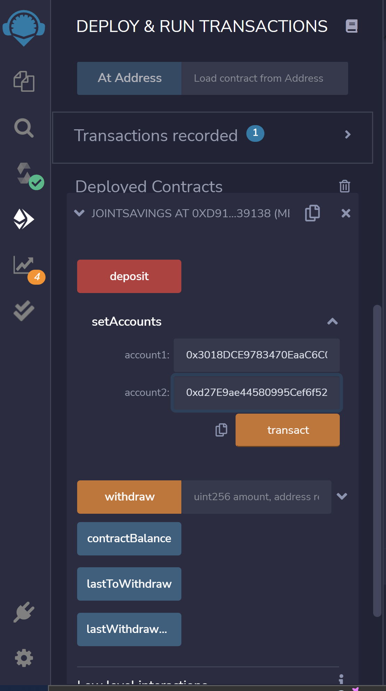
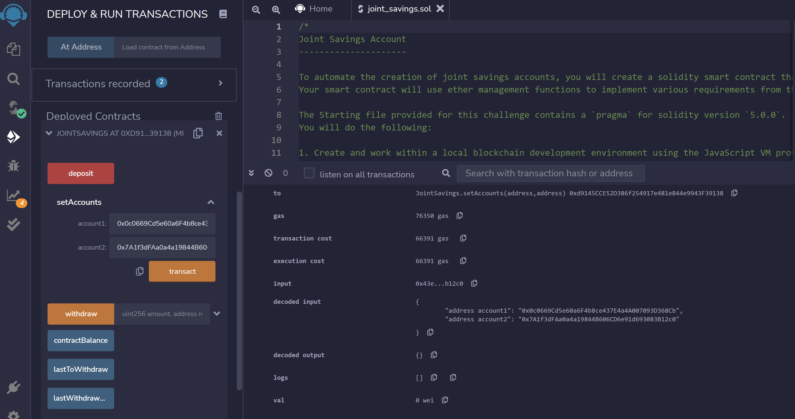
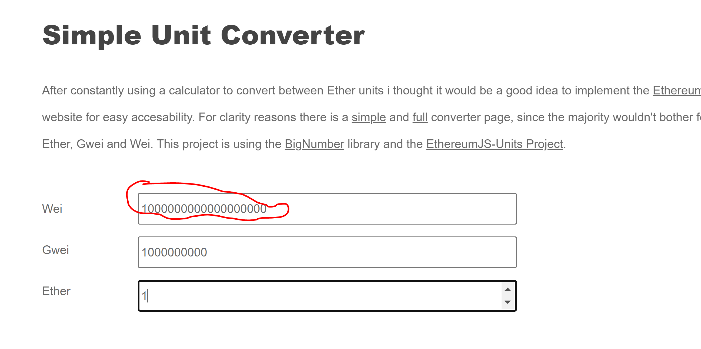
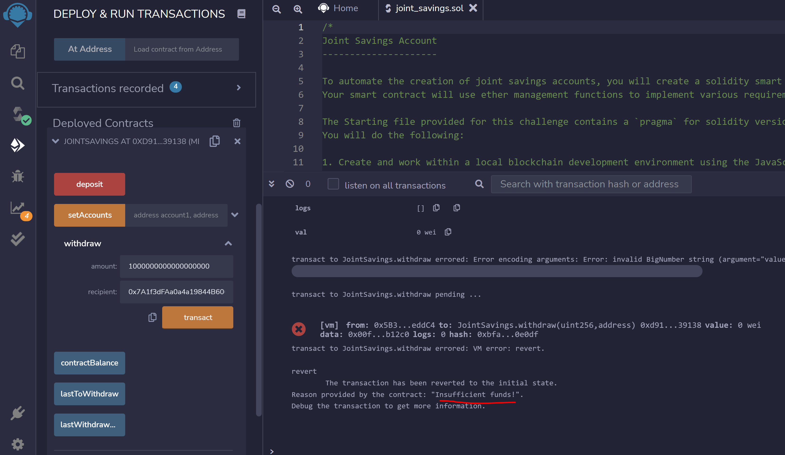
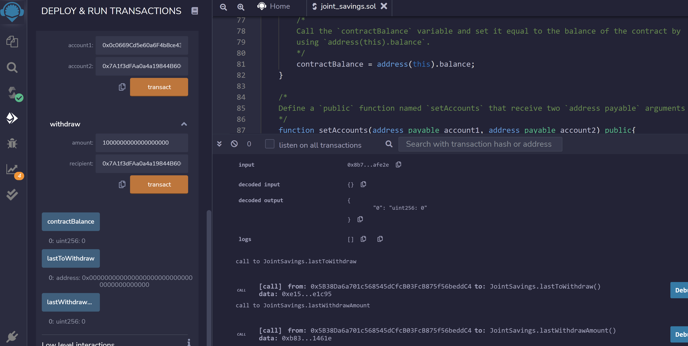

# Blockchain Challenge 3

## Background

A fintech startup company has recently hired you. This company is disrupting the finance industry with its own cross-border, Ethereum-compatible blockchain that connects financial institutions. Currently, the team is building smart contracts to automate many of the institutions’ financial processes and features, such as hosting joint savings accounts.

To automate the creation of joint savings accounts, you’ll create a Solidity smart contract that accepts two user addresses. These addresses will be able to control a joint savings account. Your smart contract will use ether management functions to implement a financial institution’s requirements for providing the features of the joint savings account. These features will consist of the ability to deposit and withdraw funds from the account.

## Task

1- Create a Joint Savings Account Contract in Solidity

2- Compile and Deploy Your Contract in the JavaScript VM

3- Interact with Your Deployed Smart Contract

## Screenshots

### Code Compiled Successfully

### Code Deployed Successfully

### Dummy Accounts

### Set Accounts

#### Two Dummy Accounts Entered

#### Accounts Information 

##### NOTE: the WEI amount is `0` in the accounts

### WEI conversion amount used for withdrawal
As WEI in the account is zero therefore, require statement will fail and return the statement

#### Withdrawal Execution Result

#### Withdrawal Amount 

